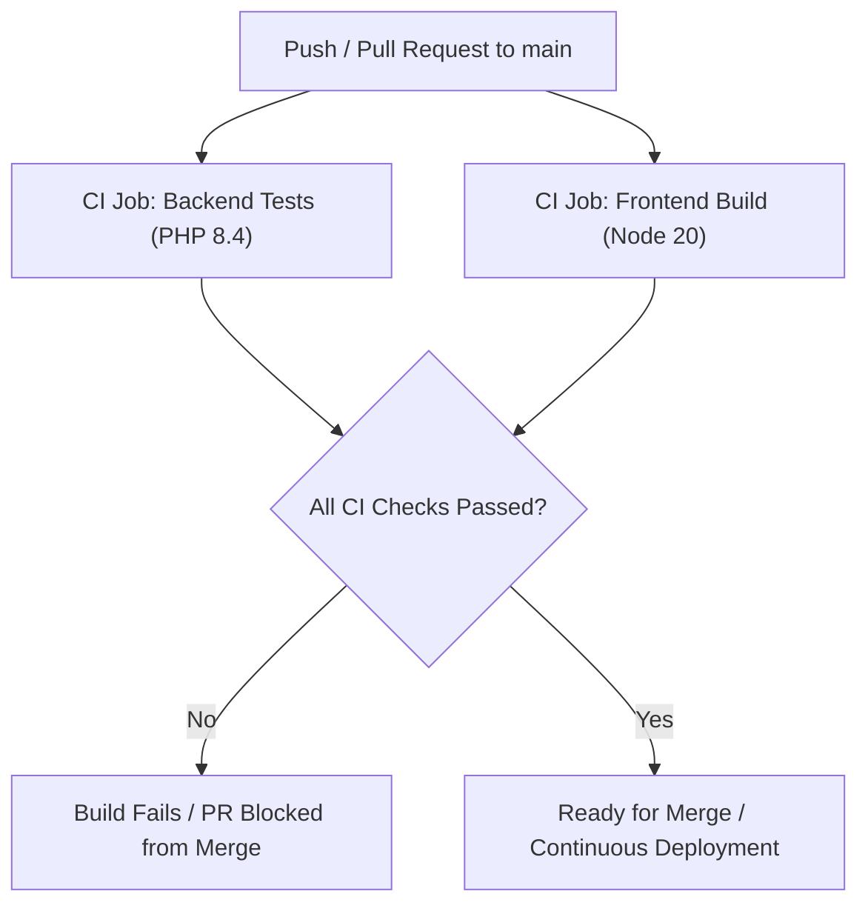
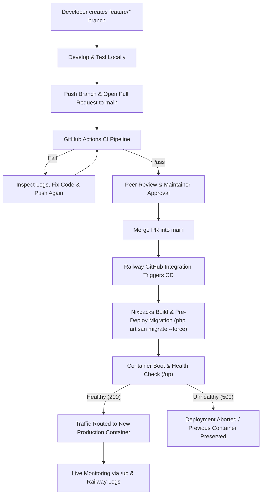

# Production Deployment & Operations Guide

This guide details the planned production architecture, verified local deployment readiness, continuous integration (CI) pipeline, and operational procedures for the **BrickBeam Construction Management System** (Week 11 CI/CD Submission).

---

## 1. Planned Production Architecture (Railway Target)

BrickBeam is engineered as a **monolithic Laravel 12 application** utilizing **Inertia.js** with **Vue 3**:
* **Application Runtime Layer**: Executing Laravel 12 on PHP 8.4+ managed via Railpack / Nixpacks (`nixpacks.toml`) on Railway.
* **Frontend Compilation Layer**: Vue 3 with Tailwind CSS and Ziggy, compiled by Vite 6 into `public/build`. Static assets are served directly from `public/`.
* **Database Layer**: Managed MySQL 8.0+ provisioned via Railway's MySQL plugin with private network communication.
* **Storage Layer**: Local filesystem disk symlinked via `php artisan storage:link` from `storage/app/public` to `public/storage`. In production, a persistent volume mount (`/app/storage/app/public`) or cloud object storage (AWS S3 / Cloudflare R2) is required to retain user uploads across deployments.
* **Health & Readiness Probes**: Laravel 12 native `/up` endpoint configured as the Railway healthcheck path.
* **Deployment Mechanism**: Railway's native GitHub repository integration, automatically triggering builds upon commits merged into the `main` branch following successful GitHub Actions CI verification.
* **Deployment Downtime Characteristics**: On single-container hosting (such as Railway Hobby/Starter plans), container replacement incurs a brief traffic switchover rather than true zero-downtime rolling deployment. High-availability zero-downtime deployments require multi-instance horizontal scaling with upstream load balancer health routing.

### Platform Comparison & Evaluation

| Platform | Viability | Architectural Assessment |
| :--- | :--- | :--- |
| **Railway (Recommended Target)** | **Ideal** | Native PHP 8.4+ & Node 20 via Railpack / Nixpacks (`nixpacks.toml`), private MySQL service linking, pre-deploy release command, volume support. |
| **Render** | **Requires Docker** | Native runtime lacks modern PHP 8.4+ support, requiring custom Dockerfile setup. Free tier introduces 50s cold-start delays. |
| **Ubuntu VPS (DigitalOcean/Hetzner)** | **Production Standard** | Native PHP-FPM, Nginx, MySQL, and persistent disk. Requires manual server management or orchestration tooling (Laravel Forge/Ploi). |
| **Laravel Cloud** | **Enterprise** | Purpose-built platform for Laravel, but requires an active paid subscription/invitation. |

### Environment Matrix & Deployment Scope

| Environment | Purpose | Key Characteristics |
| :--- | :--- | :--- |
| **Development** | Local feature development | `APP_ENV=local`, debug mode enabled, SQLite/MySQL development database, Vite HMR server. |
| **Testing / CI** | Automated quality gate & verification | `APP_ENV=testing`, SQLite in-memory (`:memory:`), automated PHPUnit tests, compiled Vite assets. |
| **Production** | Cloud deployment target (Railway) | `APP_ENV=production`, debug disabled, managed MySQL 8.0+, container `stderr` logging, HTTPS-only secure cookies. |

> [!IMPORTANT]
> **Environment & Staging Scope**:
> - **Current Architecture**: This project employs a standard three-tier progression: **Local Development** → **Automated CI/Testing Gate** → **Production Target**.
> - **Staging Status**: A separate cloud staging environment is **NOT** currently provisioned. Continuous Integration (GitHub Actions) serves as the primary automated quality and regression gate prior to merging to `main`. A dedicated staging service or branch can be provisioned in the future should team scaling or client acceptance testing require it.
> - **Deployment Readiness vs. Live Provisioning**: Production deployment configuration (`nixpacks.toml`, release-phase migrations, runtime caching, environment templates) is fully implemented and documented; however, the live Railway project and MySQL database must be provisioned by the repository owner using the manual setup steps in [Section 5](#5-manual-railway-setup-steps-target-deployment).

---

## 2. Features Verified Locally

The following operational features and deployment prerequisites have been implemented and locally verified:

* **Automated Backend Test Suite**:
  - Configured PHPUnit 11 with SQLite in-memory database (`:memory:`) in `phpunit.xml`.
  - Full test suite passing (28 tests, 65 assertions), including authentication flows, user profile management, password resets, database health diagnosis, HTTP request logging telemetry, and route protections.
* **Database-Aware Health Check Probe (`/up`)**:
  - Laravel 12 native `/up` endpoint integrated with `DiagnosingHealth` in `AppServiceProvider` to actively verify database responsiveness (`DB::connection()->getPdo()`).
  - Verified via feature tests (`ExampleTest`), returning HTTP `200 OK` when healthy and HTTP `500 Server Error` on database failure.
* **Lightweight HTTP Request Telemetry**:
  - Middleware `LogHttpRequests` logs method, path, response status, duration (ms), and client IP address at `info` level without exposing credentials, tokens, or sensitive payload data.
* **Frontend Production Asset Compilation**:
  - Vite 6 asset bundling (`npm run build`) tested and confirmed, generating production bundles in `public/build`.
* **Buildpack Configuration (`nixpacks.toml` & Railpack)**:
  - Setup phase verified for PHP 8.4, required PHP extensions (`pdo_mysql`, `pdo_sqlite`, `mbstring`, `bcmath`, `gd`, `intl`, `zip`), Composer 2, and Node.js 20.
  - Build phase handles Composer production optimization (`composer install --no-dev --optimize-autoloader`) and frontend compilation (`npm ci && npm run build`).
  - Container start routine cleanly configured to optimize caches (`config:cache`, `route:cache`, `view:cache`) without executing dangerous database migrations during container reboot.
* **Environment Separation**:
  - `.env.example` maintained with safe defaults, `QUEUE_CONNECTION=sync` for single-container architecture, and commented `SESSION_SECURE_COOKIE` production guidance.
  - Zero secrets or hardcoded encryption keys tracked in repository version control.

---

## 3. GitHub Actions Continuous Integration (CI) Pipeline

The workflow defined in [`.github/workflows/ci.yml`](.github/workflows/ci.yml) automates quality control on all pull requests and pushes to `main`:



### Pipeline Responsibilities:
1. **`backend-tests`**: Runs on Ubuntu Latest, installs PHP 8.4 with all necessary extensions, caches Composer dependencies, executes `php artisan key:generate`, validates Laravel boot (`php artisan about`), and executes `php artisan test` against in-memory SQLite.
2. **`frontend-build`**: Runs on Ubuntu Latest, configures Node.js 20 with npm caching, installs dependencies via `npm ci`, and verifies asset compilation via `npm run build`.

> [!NOTE]
> GitHub Actions is dedicated to CI validation. Continuous Deployment (CD) is handled natively by Railway's GitHub integration upon branch update, preventing duplicate deployment triggers and eliminating unnecessary webhook secret dependencies.

---

## 4. Production Environment Configuration Guide

> [!CAUTION]
> **CRITICAL PRODUCTION KEY SECURITY**:
> - Never commit a production `APP_KEY` or `.env` file to Git.
> - Generate a fresh production encryption key directly in your terminal using:
>   ```bash
>   php artisan key:generate --show
>   ```
> - Paste the generated key directly into the Railway Environment Variables dashboard.
> - Treat any previously exposed or local development key as compromised; never reuse it.

### Required Production Environment Variables (Railway Dashboard)

#### Application Core
```env
APP_NAME="BrickBeam"
APP_ENV=production
APP_KEY=<Freshly generated key from: php artisan key:generate --show>
APP_DEBUG=false
APP_URL=https://${{RAILWAY_PUBLIC_DOMAIN}}
```

#### Managed Database (Railway MySQL Service Linking)
```env
DB_CONNECTION=mysql
DB_HOST=${{MySQL.MYSQLHOST}}
DB_PORT=${{MySQL.MYSQLPORT}}
DB_DATABASE=${{MySQL.MYSQLDATABASE}}
DB_USERNAME=${{MySQL.MYSQLUSER}}
DB_PASSWORD=${{MySQL.MYSQLPASSWORD}}
```

#### Session, Cache, Queue & Filesystem
```env
# Session Security (Required for HTTPS in production)
SESSION_DRIVER=database
SESSION_LIFETIME=120
SESSION_ENCRYPT=true
SESSION_SECURE_COOKIE=true
SESSION_HTTP_ONLY=true
SESSION_SAME_SITE=lax

# Database Cache Store
CACHE_STORE=database

# Queue Configuration: Single-container deployment with no queue worker daemon
QUEUE_CONNECTION=sync

# File Storage
FILESYSTEM_DISK=public
```

> [!NOTE]
> **Queue Architecture**: BrickBeam currently does not define asynchronous job classes or queued notifications, and the deployment architecture runs a single web container without a background `queue:work` process. Synchronous queue processing (`QUEUE_CONNECTION=sync`) is intentional so any dispatched operations complete within the request lifecycle. If asynchronous jobs are introduced in future releases, a dedicated background worker container and appropriate queue driver will be configured.

#### Logging & Mail
```env
# Logging: Stream directly to container standard error for Railway log ingestion
LOG_CHANNEL=stderr
LOG_LEVEL=error

MAIL_MAILER=log
```

> [!NOTE]
> **Containerized Logging**: Setting `LOG_CHANNEL=stderr` routes Monolog output directly to the container's standard error stream (`php://stderr`). This enables Railway to ingest and display real-time application logs in the platform dashboard without relying on ephemeral disk storage.

---

## 5. Manual Railway Setup Steps (Target Deployment)

To perform the initial deployment of BrickBeam to Railway, follow these steps in the Railway Dashboard:

### Step 1: Create Railway Project & Database
1. Log into [Railway](https://railway.app).
2. Click **New Project** → **Provision MySQL**.
3. Railway will provision a managed MySQL 8.0 instance and expose internal connection variables.

### Step 2: Connect GitHub Repository
1. In the same project, click **New Service** → **GitHub Repo**.
2. Select `BrickBeam-Construction-Management-System-`.
3. Set the deployment branch to `main`.

### Step 3: Configure Environment Variables
1. Navigate to the web service's **Variables** tab.
2. Add all variables listed in [Section 4](#4-production-environment-configuration-guide).
3. Ensure `APP_KEY` is generated freshly and set securely.

### Step 4: Configure Release Phase (Pre-Deploy Command)
1. Go to **Settings** → **Deploy**.
2. Under **Pre-deploy Command**, enter:
   ```bash
   php artisan migrate --force
   ```
3. *Why this matters*: Running migrations as a pre-deploy release step executes once per deployment in an isolated container. If migrations fail, the deployment is safely aborted without affecting the running application. It also prevents migrations from executing redundantly during container restarts.

### Step 5: Configure Health Check Path
1. In **Settings** → **Deploy**, locate **Healthcheck Path**.
2. Enter:
   ```text
   /up
   ```
3. Set **Healthcheck Timeout** to `100` seconds. Railway will poll this endpoint before routing public traffic to the new container.

### Step 6: Configure Persistent Storage Volume (Optional / Recommended)
1. Under the web service settings, navigate to **Volumes**.
2. Mount a persistent volume at:
   ```text
   /app/storage/app/public
   ```
3. This ensures client-uploaded blueprints, photos, and project assets are preserved across deployments when using local filesystem storage.

### Step 7: Verify Initial Deployment
1. Observe the build logs in Railway to confirm Nixpacks compiles PHP and Node assets cleanly.
2. Once the health check passes, access the generated domain (`https://${{RAILWAY_PUBLIC_DOMAIN}}`).
3. Verify public pages and test login at `/admin/login`.

---

## 6. Build, Release & Runtime Specifications

When a deployment is triggered on Railway, the lifecycle proceeds as defined in [`nixpacks.toml`](nixpacks.toml):

1. **Build Phase** (executed during image generation):
   ```bash
   composer install --no-dev --optimize-autoloader --no-interaction
   npm ci
   npm run build
   php artisan storage:link
   ```

2. **Pre-Deploy Release Phase** (executed once prior to traffic routing):
   ```bash
   php artisan migrate --force
   ```

3. **Start / Runtime Phase** (executed when the web container launches):
   ```bash
   php artisan config:cache && php artisan route:cache && php artisan view:cache && php artisan serve --host=0.0.0.0 --port=${PORT:-8000}
   ```

---

## 7. Monitoring & Operational Logging

* **Liveness & Health Endpoint**: `GET /up` returns HTTP `200 OK` when the application core and configured database connection respond. If the database is unreachable, it reports HTTP `500 Server Error`.
* **Container Log Streaming (`stderr`)**: In containerized environments, Monolog is configured with `LOG_CHANNEL=stderr` to stream events to `php://stderr`. Railway captures stdout/stderr in real time under the **Deployments → View Logs** tab.
* **HTTP Request Telemetry**: Middleware `LogHttpRequests` logs incoming HTTP requests (method, path, HTTP status, duration in milliseconds, and client IP) at `info` level without capturing authentication headers, cookies, passwords, or personal data.
* **Application Error Logging**: Unhandled exceptions and error-level events are reported to Monolog and streamed to container stderr.
* **Internal Admin Telemetry**: Administrative dashboard at `/admin/system-metrics` provides real-time active session counts (`DB::table('sessions')->count()`) and audit trail inspection (`spatie/laravel-activitylog`).

---

## 8. Backup & Data Protection Policy

* **Automated Database Backups**: On Railway, automated daily database backups are available on the paid Hobby plan ($5/mo) with 7-day retention. On trial/free plans, automatic backups are not enabled by default.
* **Manual Database Export Procedure**:
  ```bash
  mysqldump -h $DB_HOST -P $DB_PORT -u $DB_USERNAME -p$DB_PASSWORD $DB_DATABASE > backup_$(date +%F_%T).sql
  ```
* **Database Restoration Procedure**:
  ```bash
  mysql -h $DB_HOST -P $DB_PORT -u $DB_USERNAME -p$DB_PASSWORD $DB_DATABASE < backup.sql
  ```

---

## 9. Rollback Strategy

1. **Application Code Rollback**:
   * **Instant Container Rollback**: In the Railway Deployments dashboard, select the previous successful deployment and click **Rollback**. The previous container image is immediately restored.
   * **Git-Driven Rollback**: Run `git revert <commit-sha>` on `main` and push. GitHub Actions CI will validate the reverted code, and Railway will automatically deploy the known good commit.
2. **Database Rollback**:
   * *Caution*: Rolling back application code does not alter the database schema. If a schema rollback is strictly necessary, execute:
     ```bash
     php artisan migrate:rollback --force
     ```
   * *Critical Principle*: Application code is stateless and safe to revert; database schema rollbacks can be destructive to data collected during the deployment window. Always capture a manual database dump before executing schema rollbacks.

---

## 10. Git Branching, Pull Request & Release Workflow

BrickBeam adheres to a trunk-based feature branching model where the `main` branch represents deployable production code:



### Step-by-Step Workflow:
1. **Branch Creation**: Create a descriptive feature branch from `main`:
   ```bash
   git checkout main && git pull origin main
   git checkout -b feature/your-feature-name
   ```
2. **Local Development & Verification**: Implement changes and verify locally with tests and build checks:
   ```bash
   php artisan test
   npm run build
   ```
3. **Push & Open Pull Request**: Push the feature branch to GitHub and open a Pull Request targeting `main`.
4. **Automated CI Quality Gate**: GitHub Actions runs frontend asset compilation (Node 20) and backend PHPUnit tests (PHP 8.4). Any failure blocks merging.
5. **Review & Approval**: Code review is conducted. Once approved and CI passes, the PR is merged into `main`.
6. **Automated Continuous Deployment**: Merging to `main` triggers Railway's webhook integration to build the Nixpacks container image.
7. **Release Phase Migration**: Railway executes `php artisan migrate --force` as a pre-deploy release command.
8. **Health Check Validation**: Railway polls `/up` before routing traffic. Once HTTP `200` is confirmed, traffic is routed to the new container.
9. **Post-Deployment Monitoring**: Operational logs are monitored via the Railway Deployments log console.
10. **Rollback (if needed)**: Instant container rollback in Railway or `git revert` on `main`.

---

## 11. Troubleshooting & Operational Diagnostics

| Symptom / Issue | Probable Cause | Diagnostic & Resolution Steps |
| :--- | :--- | :--- |
| **HTTP 500 on `/up`** | Database unreachable or credentials misconfigured | Verify Railway MySQL service status; check `DB_HOST`, `DB_PORT`, `DB_DATABASE`, `DB_USERNAME`, `DB_PASSWORD` variables in Railway dashboard. |
| **Vite assets missing or 404** | Build artifact or symlink issue | Confirm `npm run build` executed in build logs; confirm `php artisan storage:link` ran during Nixpacks build phase. |
| **Mixed Content / HTTP assets on HTTPS** | Reverse proxy headers not trusted | Configured via `$middleware->trustProxies(at: '*')` in `bootstrap/app.php` and `URL::forceScheme('https')` in `AppServiceProvider.php`. |
| **Migrations failing on deploy** | SQL syntax error or lock conflict | Inspect Railway Pre-deploy Command logs; verify schema migrations locally before pushing. |
| **Container crash loop on boot** | Configuration cache syntax error or missing `APP_KEY` | Ensure `APP_KEY` is set in Railway variables; check container startup logs for fatal PHP errors. |

---

## 12. Production Readiness Checklist

| Category | Component / Requirement | Status | Verification Reference |
| :--- | :--- | :---: | :--- |
| **CI/CD** | Automated multi-job CI pipeline | **Implemented & Verified** | [`.github/workflows/ci.yml`](.github/workflows/ci.yml) (Runs #3, #4, #5 passing) |
| **CI/CD** | Automated Railway deployment on merge to `main` | **Configured** | Documented Railway integration workflow |
| **Monitoring** | Database-aware `/up` health probe | **Implemented & Verified** | [`app/Providers/AppServiceProvider.php`](app/Providers/AppServiceProvider.php), [`ExampleTest.php`](tests/Feature/ExampleTest.php) |
| **Monitoring** | Containerized `stderr` log streaming | **Implemented & Verified** | [`config/logging.php`](config/logging.php), `LOG_CHANNEL=stderr` |
| **Monitoring** | HTTP request telemetry middleware | **Implemented & Verified** | [`app/Http/Middleware/LogHttpRequests.php`](app/Http/Middleware/LogHttpRequests.php), [`HttpRequestLoggingTest.php`](tests/Feature/HttpRequestLoggingTest.php) |
| **Monitoring** | Admin system metrics dashboard | **Implemented & Verified** | [`routes/admin.php`](routes/admin.php) (`/admin/system-metrics`) |
| **Security** | Zero committed `.env` secrets | **Verified** | [`.gitignore`](.gitignore), [`.env.example`](.env.example) |
| **Security** | HTTPS-only secure session cookies | **Configured** | `SESSION_SECURE_COOKIE=true`, `SESSION_ENCRYPT=true` |
| **Security** | Reverse proxy trust & HTTPS URL generation | **Implemented & Verified** | [`bootstrap/app.php`](bootstrap/app.php), [`app/Providers/AppServiceProvider.php`](app/Providers/AppServiceProvider.php), [`HttpsTrustProxyTest.php`](tests/Feature/HttpsTrustProxyTest.php) |
| **Runtime** | Buildpack container definition | **Implemented & Verified** | [`nixpacks.toml`](nixpacks.toml) (PHP 8.4 + Node 20) |
| **Runtime** | Decoupled release-phase migrations | **Configured** | Pre-deploy command: `php artisan migrate --force` |
| **Runtime** | Single-container queue configuration | **Implemented & Verified** | `QUEUE_CONNECTION=sync` |
| **Infrastructure** | Live Railway project & MySQL instance | **Manual Setup Required** | Requires repository owner account provisioning |
